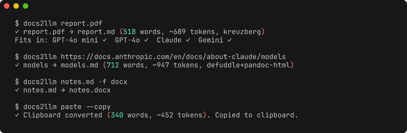
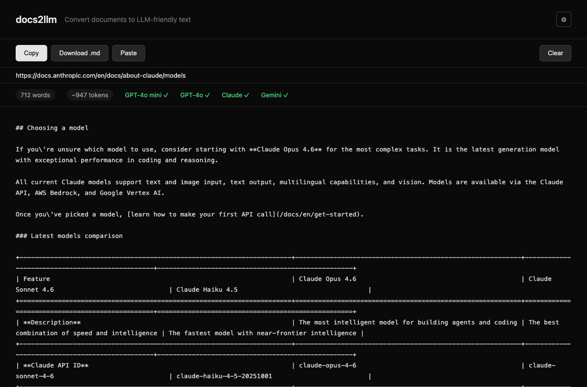

# docs2llm

Turn documents into LLM-ready Markdown. Local-first, one command, no cloud APIs.

You have a PDF report, a PowerPoint deck, a budget spreadsheet, a web article. You need clean text for Claude, ChatGPT, or Gemini. docs2llm converts 75+ formats into structured Markdown with headings, tables, and lists preserved — and counts tokens so you know what fits. It also converts Markdown *back* to Word, PowerPoint, or HTML when you need to share with people who don't live in a terminal.



## Install

```bash
# Homebrew (macOS — no Bun required)
brew install al-ignat/tap/docs2llm

# Or download the binary directly from GitHub Releases
# https://github.com/al-ignat/docs2llm/releases

# Or via Bun (requires Bun runtime)
bunx docs2llm                # no install needed
bun install -g docs2llm      # global install
```

Outbound conversion (Markdown → DOCX/PPTX/HTML) also needs [Pandoc](https://pandoc.org) (`brew install pandoc`).

## Quick Examples

```bash
docs2llm report.pdf                  # PDF → Markdown
docs2llm ./docs/                     # convert an entire folder
docs2llm https://example.com/article # web page → Markdown
docs2llm paste --copy                # clipboard → clean Markdown → clipboard
docs2llm notes.md -f docx            # Markdown → Word document
docs2llm                             # interactive wizard (no args)
```

Every conversion shows token count and engine used:

```
✓ report.pdf → report.md (2,340 words, ~3,100 tokens, kreuzberg)
```

## Use It Where You Work

### CLI

One command in the terminal. Converts files, folders, URLs, and stdin. Run with no arguments for an interactive wizard that scans your current directory and recent downloads.

### Raycast

Six commands with smart auto-detection. Select a file in Finder, hit a keyboard shortcut, get Markdown on your clipboard. Three view commands (Convert File, Convert Clipboard, Quick Convert) and three no-view smart commands (Smart Copy, Smart Paste, Smart Save) that auto-detect your source and conversion direction.

<!-- TODO: GIF — Raycast Smart Copy demo (record manually in Raycast) -->

See [raycast/README.md](raycast/README.md) for setup.

### Web UI

```bash
docs2llm open
```

Drag-and-drop interface at localhost. Drop any file, paste a URL, or Cmd+V from clipboard. Supports inbound and outbound conversion, template selection, and dark theme.



### MCP Server

```bash
docs2llm serve
```

Exposes docs2llm as a tool server for [Claude Desktop](https://claude.ai/download), [Cursor](https://cursor.com), or any MCP client. Four tools: `convert_file`, `convert_url`, `convert_to_document`, `list_formats`.

```json
{
  "mcpServers": {
    "docs2llm": { "command": "bunx", "args": ["docs2llm", "serve"] }
  }
}
```

## Best For

- Converting work documents (reports, decks, specs, budgets) into prompt-ready text
- Extracting clean article content from web pages and URLs
- Clipboard workflows: copy from browser or email, paste as Markdown
- Batch conversion of document folders
- Exporting Markdown back to Word or PowerPoint for non-technical stakeholders
- Token budgeting for LLM context windows
- Local and private workflows — no data leaves your machine

## Not Best For

- Complex PDF tables with merged cells (some structure may be lost)
- Scanned PDFs without [Tesseract](https://github.com/tesseract-ocr/tesseract) installed
- Email HTML with heavy templating (footers and unsubscribe links may leak through)
- Replacing dedicated PDF parsing pipelines for production data extraction

## Conversion Quality

Quality is measured, not guessed. An evaluation harness runs against real-world documents across 8 format classes:

| Format | Score |
|--------|-------|
| DOCX / XLSX | 1.0 |
| Article HTML | 0.99 |
| Webpage HTML | 0.96 |
| PPTX | 0.91 |
| PDF (digital) | 0.86 |
| Email HTML | 0.84 |

Scores are tracked across releases. See [eval/](eval/) for methodology and fixtures.

## Supported Formats

**Documents**: PDF, DOCX, PPTX, XLSX, ODT, ODP, ODS, RTF | **Web**: URLs, HTML, XML | **Email**: EML, MSG | **Images** (OCR): PNG, JPG, TIFF, BMP, GIF, WEBP | **eBooks**: EPUB, MOBI | **Data**: CSV, TSV, TXT | **Code**: most source files

Run `docs2llm formats` for the full list. Outbound: Markdown → DOCX, PPTX, HTML.

## Configuration

```bash
docs2llm init              # create config in current directory
docs2llm config            # manage interactively
```

Example `.docs2llm.yaml`:

```yaml
defaults:
  format: docx
  outputDir: ./out

templates:
  report:
    format: docx
    pandocArgs: [--toc, --reference-doc=./templates/report.docx]
```

See [docs/REFERENCE.md](docs/REFERENCE.md) for full config schema and template options.

## Further Reading

- [Full CLI Reference](docs/REFERENCE.md) — all commands, options, piping, watch mode, chunking, MCP setup
- [Raycast Extension](raycast/README.md) — setup, commands, preferences
- [Evaluation Harness](eval/README.md) — quality methodology and fixtures
- [Roadmap](ROADMAP.md) — what's next

## License

MIT
